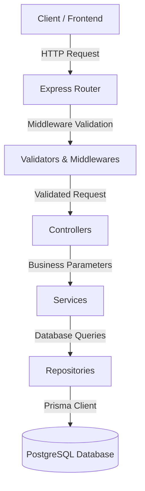

# System Architecture Documentation

This document describes the architectural design, patterns, directory structure, and technical components of the NexaERP backend application.

---

## Architectural Pattern: Layered Architecture

NexaERP is built using a clean, layered architectural pattern, promoting separation of concerns, testability, and maintainability. It follows a **Controller-Service-Repository** pattern.



### Description of Layers

1. **Routing Layer (`src/routes/*`)**:
   Defines the API endpoints, HTTP verbs, and specifies which middleware and controller should handle each request. These files also contain inline OpenAPI/Swagger documentation.
2. **Middleware & Validator Layer (`src/middleware/*` & `src/validators/*`)**:
   - Performs security settings (Helmet, CORS), rate limiting, and parses body elements (cookie parser).
   - Validates user input schemas using `express-validator`.
   - Handles global error catch-all procedures (`error.middleware.ts`).
   - Validates authentication state and decodes JWT payloads (`auth.middleware.ts`).
3. **Controller Layer (`src/controllers/*`)**:
   Acts as the orchestrator. It extracts inputs from Express requests (query parameters, route parameters, body parameters), calls the appropriate service method, and formats the output into a standardized JSON response using `ApiResponse`.
4. **Service Layer (`src/services/*`)**:
   Contains core business logic, validation rules, encryption/decryption (e.g., hashing passwords with `bcrypt`), and workflow management. Services are decoupled from Express constructs (request and response objects).
5. **Repository Layer (`src/repositories/*`)**:
   Contains database retrieval and storage queries. Repositories abstract the database layout and query optimization from the services using the Prisma Client.
6. **Database Layer (Prisma & PostgreSQL)**:
   Persists the data. Prisma ORM acts as the data-mapping engine, running migrations and providing TypeScript safety.

---

## Directory Structure

Here is a map of the backend source files structure:

```text
backend/src/
├── app.ts                 # Express app initialization, CORS, global middlewares
├── server.ts              # Entry point: DB check, starts port listener
├── config/                # Configuration files (database client, swagger setup, env)
├── constants/             # Constants such as HTTP status codes
├── controllers/           # Route controllers (translates requests to service calls)
├── interfaces/            # TypeScript type definitions and interfaces
├── lib/                   # Library clients (e.g., Prisma instance)
├── middleware/            # Custom middleware (auth validation, error handling)
├── repositories/          # Database operations layer
├── routes/                # API route definitions & Swagger documentation
├── services/              # Core business logic layer
├── utils/                 # General helpers (JWT helper, environment checks)
└── validators/            # Request payload validators
```

---

## Database Schema & ER Model Overview

The database uses PostgreSQL. Key entities and relationships defined in the Prisma schema are:

- **User**: Stores employee/system user records. Includes user roles (`ADMIN`, `SALES`, `WAREHOUSE`, `ACCOUNTS`) and relationships to items they created.
- **Customer & Follow-Up**: Tracks leads, clients (`RETAIL`, `WHOLESALE`, `DISTRIBUTOR`), their status (`LEAD`, `ACTIVE`, `INACTIVE`), and corresponding sales or follow-up notes.
- **Warehouse**: Stores locations where inventory is managed.
- **Product**: Holds item details (stock quantities, thresholds, pricing details) registered under specific Warehouses.
- **StockMovement**: Logs warehouse inventory transactions (`IN`, `OUT`, `TRANSFER`) with completion statuses.
- **SalesChallan & Items**: Represents sale delivery notes, keeping snapshots of product prices, billing summaries, payment status, and items delivered.

---

## Key Technologies & Libraries

- **Runtime**: Node.js with TypeScript (`tsx` for dev compilation and execution).
- **Web Framework**: Express.js (v5.x).
- **ORM**: Prisma (with PostgreSQL connector).
- **Authentication**: JSON Web Tokens (`jsonwebtoken`) & password hashing via `bcrypt`.
- **Security**: `helmet` (HTTP headers security), `cors` (origin control), `express-rate-limit` (DDoS mitigation).
- **Documentation**: Swagger via `swagger-jsdoc` and `swagger-ui-express`.
